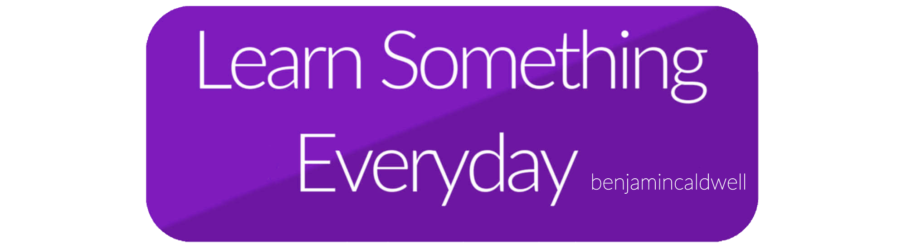

# 

As a developer, I always aim to learn new concepts and ideas that will allow me to grow and have a greater understanding of software. Throughout my career, I hope to grow this repository with summary notes on new topics. Check it out if you're interesting in seeing what I've learned, and stay up to date! 

<!--Also this is a shameless rip off of [Kevin's repo](https://github.com/kevintpeng/Learn-Something-Everyday)-->

