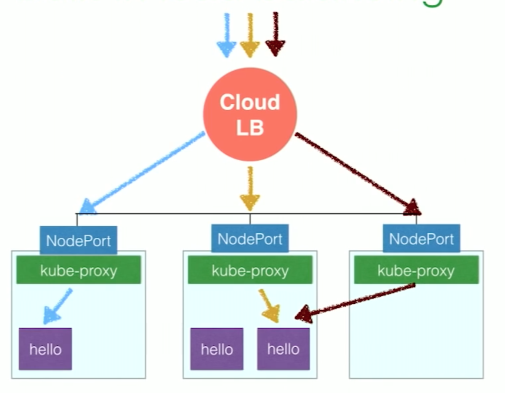
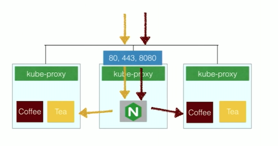
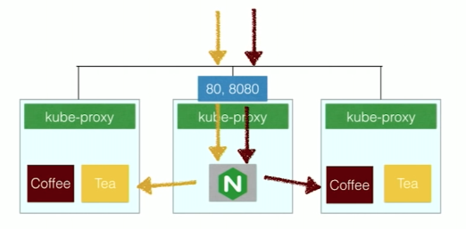

# Load Balancing Kubernetes Services with NGINX

## Why

- load balancer service is limited:
	- how it works:
		- creates a node port on each node (requests are proxied by kube-proxy
		- puts cloud load balancer in front with IP address
		- 
	- Pros:
		- easy to set up
	- Cons:
		- limited to basic layer 4 load balancing (TCP/UDP)

## Ingress

- ingress controller (must be deployed) does integration between software and load balancer
- define HTTP load balancing rule to route external traffic to your services
	- path-based routing
	- ssl termination
	- multiple virtual servers
- Pluggable load balancer implementation
	- EX: NGINX / GCE HTTP load balancer / HAProxy / ect
- for NGINX, controller runs in same container as NGINX [github](https://github.com/nginxinc/kubernetes-ingress)
- ssl termination:
	- create secret with certificate
	- define ingress configuration:
			
		```
		apiVersion: extensions/v1beta1
		kind: Ingress
		metadata:
		  name: cafe-ingress
		spec:
		  tls:
		  - hosts:
		    - cafe.example.com
		    secretName: cafe-secret
		  rules:
		  - host: cafe.example.com
		    http:
		      paths:
		      - path: /tea
		        backend:
		          serviceName: tea-svc
		          servicePort: 80
		      - path: /coffee
		        backend:
		          serviceName: coffee-svc
		          servicePort: 80
		```
		[source](https://github.com/nginxinc/kubernetes-ingress/blob/master/examples/complete-example/cafe-ingress.yaml)	

- pros:
	- easy to use and deploy
	- configured via kubernetes resources
- con:
	- doesnt support advanced load balancing scenarios

### Nginx ingress controller
- create nginx ingress service that exposes ports 80,443.
- traffic enters service and is proxied to correct service
- 
- deploy configuration example

```
apiVersion: v1
kind: ReplicationController
metadata:
  name: nginx-ingress-rc
  labels:
    app: nginx-ingress
spec:
  replicas: 1
  selector:
    app: nginx-ingress
  template:
    metadata:
      labels:
        app: nginx-ingress
    spec:
      containers:
      - image: nginxdemos/nginx-ingress:0.7.0
        imagePullPolicy: Always
        name: nginx-ingress
        ports:
        - containerPort: 80
          hostPort: 80
        - containerPort: 443
          hostPort: 443
```

- nginx plus exposes dashboard on 8080

#### Ingress NGINX extensions
- Websocket-servers load balancer

```
apiVersion: extensions/v1beta1
kind: Ingress
metadata:
  name: cafe-ingress
  annotations:
    nginx.org/websocket-services: "ws-svc"
spec:
  rules:
  - host: cafe.example.com
    http:
      paths:
      - path: /ws
        backend:
          serviceName: ws-svc
          servicePort: 8008
```    
- NGINX customization
- using ingress or configMap (all ingresses)

```
kind: ConfigMap
apiVersion: v1
metadata:
  name: nginx-config
data:
  proxy-connect-timeout: "10s"
  proxy-read-timeout: "10s"
  client-max-body-size: "2m"
```

```
metadata:
  name: cafe-ingress-with-annotations
  annotations:
    nginx.org/proxy-connect-timeout: "30s"
    nginx.org/proxy-read-timeout: "20s"
    nginx.org/client-max-body-size: "4m"
```

[details](https://github.com/nginxinc/kubernetes-ingress/tree/master/examples/customization) 

## Advanced load balancing
- advanced algorithms
- connection and request limits
- access control and authorization
- URL rewrites and redirects
- TCP/UDP load balancing
- scripting
- **supported by nginx but not kubernetes**

### Custom NGINX
- greater flexibility
- lose kubernetes automation. Required to deploy new nginx config for each application deploy
- deploy nginx configuration our selves in a container
- 
- NGINX plus can automatically discover IP address of new pods (scaled service)
	- works with kubeDNS
- include `spec.clusterIP: None` in service config so that DNS resolves to all pod IPs not 1 which is load balanced by kube proxy
	- so NGINX can talk to contains and bypass kube-proxy
- make nginx.conf
	- set resolver to kube-dns
	- set upstream to kube dns name to be resolved using kube-dns
	- see video 24.30 for example config

 
[source](https://www.youtube.com/watch?v=L7JZdyJ8qJQ&t=608s)