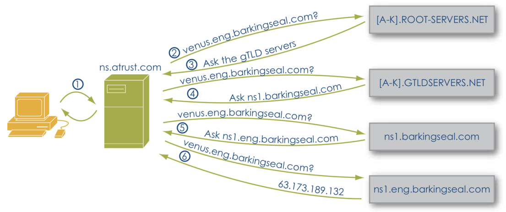

# DNS
- a hierarchical, distributed database with delegated authority
	- everyone normally manages their own
- Benefits
	- Anti-phishing
	- Anti-spam
	- privacy (network hidden from outside world)
- maps domains into addresses
- naming is hierarchical
	- names are parsed from right to left
	- DNS server knows where to find address based on top level domain name

## Definitions
- A fully qualified host name: host plus domain name. 
	- example venus.eng.barkingseal.com
- A domain name: everything but the unqualified host name
	- example: eng.barkingseal.com
- authoritative name server: server designated by proper authority for providing name mapping for a particular domain
- caching name server: stores results of previous queries 
- recursive name server: will traverse the hierarchical name space to resolve the query

## DNS mapping example

- happens quickly, but we can see the need for caching
- caching is done as close to the user as possible
- organization may have their own ns servers
- dup to caching, it can take a while to update entry updates
