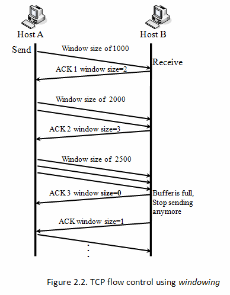
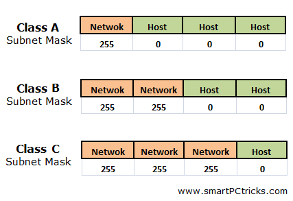

# TCP/IP and Subnet Masking

- TCP/IP v4 != TCP/IP v6

## TCP/IP overview
- is a suite of protocols. Main ones are:
	- TCP (transmission control protocol)
	- IP (internet protocol

#### IP
- **computer discovery**
- controls routing of information between different machines on a network
- allows two computers to figure out where the other one is so that they can talk
- routable protocol (you can divide networks into multiple subnetworks)
	- in non-routable all computers are connected
	- in routable
		- networks split into subnetworks where the boundary is a router
		- routes can (communicate between)/(connect to) eachother
- on OSI layer 3 (network layer)

#### TCP
- **controls the communication**
- communication language/speed
- windowing
	- process by which client information sends information to server computer
	- all information is divided into packets which are sent to the computer receiving the data
		- send packets in groups which get progressively bigger
		- 
		- if package gets missed, Host 1 will start from the beginning and send 1 packet again and repeat
	- **important** can be a real pain for real time communications
- on OSI layer 5 (transport layer)

## How TCP/IP works

- IP address
	- address that is used to signify a computer on a network
- Subnet mask
	- a way to segment the network
	- to control which computers can talk to eachother
	- EX: if you dont want all 200 computer on a network to talk to eachother (even though they are connected) you put them on subnet masks
-  Default Gateway
	-  the router for the subnetwork you are on
	-  computer looks on network for a computer first and then asks the default gateway to find it if it cant find it
	-  connects subnetwork to the other networks
-  DNS server
	-  map domain names to server IP address
	-  translate www.cnn.com to an IP address
-  DHCP
	-  dynamic host control protocol
	-  every computer needs to now its IP, subnet, default gateway and dns server
		-  can be inputted manually, static IP
			-  annoying because you cant reuse IPs and packets would go to wrong computers
		-  dynamic IPs
			-  when the computer connects it will call out to the DHCP server which will tell it its IP, subnet, default gateway and dns server
			-  automatic distribution of these things
	-  can configure the scope of IPs that it can give out
		-  ex: 192.168.0.100 - 198.168.0.199
	-  gives the information to the computer with a lease time
		-  time that the computer can own the IP address
		-  halfway through computer will try to renew the lease
			-  if it cannot connect to the DHCP server will wait another 50% of time
		-  the shorter the more traffic
-  NAT
	-  network address translation
	-  internal networks usually have ip ranges 192.168.0.1 - 192.168.0.254
	-  every router that connects to the internet needs its own ip address
	-  allows internal computer to connect externally through the router
	-  route information to who asked it
	-  allows for "duplicate IPs"

## Where do the numbers come from?
- series of 4 octet values. (8 digit binary number)
	- xxxxxxxx.xxxxxxxx.xxxxxxxx.xxxxxxxx
		- 192.168.0.10
		- 11000000.10101000.00000000.00001010

## Subnet masking
- IP address tells you 2 things
	- for IP 192.168.1.1 and subnet 255.255.255.0
	- address of the device on the network
	- subnet number/network number

- subnet mask tells you what part of the ip is the network ID and what part is the device ID 
- devices on different networks can't talk to eachother
	- even if on the same switch unless connected by a router
- 255.255.255.0 is a class C subnet
	- 192.168.1 is the network number
	- 1 is the device number
- getting the subnet mask
	- split the IP into two parts	
	- left side is for subnets
	- right side is for hosts
	- max number per octet = 2^n
	- count how many bits that you need for each part:
		- 1 represents subnets part
		- 0 represents hosts part
	- 

[source](https://www.youtube.com/watch?v=EkNq4TrHP_U)

## Classes

| Class  | Range  |  CIDR | Private Range |
|---|---|---| --- |
| A | 1-126 | /8 | 10.0.0.1 - 10.255.255.255 |
| B | 128-191  | /16 | 172.16.0.0-172.31.255.255 /12 |
| C |  192.223 |  /24 | 192.168.0.0 - 192.168.255.255 /16 |
| D | 224-239 | N/A |
| E | 240-255 | N/A |

- 0 is for universal gateway, default routes (0.0.0.0)
- 127 is for bind back (localhost)
- CIDR doesnt relate to the class because of subnets
- CIDR is number of bits that are "on" (are the network side)
- private ranges are not routable on the internet (used in NAT)
- Broadcast and range of /24

| ID | Range | Broadcast (ID + Host count)|
|---|---|---|
| X.X.X.16 | 17-30 | X.X.X.31 |
| X.X.X.32 | 32-46 | X.X.X.47 |
| X.X.X.48 | 49.62 | X.X.X.63 |
